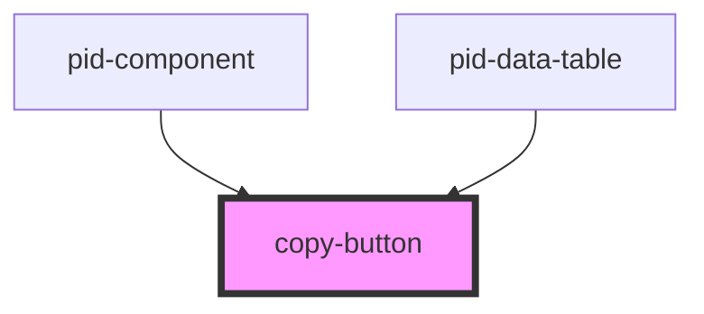

# copy-button

<!-- Auto Generated Below -->

## Properties

| Property             | Attribute | Description                                                                          | Type     | Default     |
|----------------------|-----------|--------------------------------------------------------------------------------------|----------|-------------|
| `label`              | `label`   | Optional custom label for the button. If not provided, a default label will be used. | `string` | `undefined` |
| `value` _(required)_ | `value`   | The value to copy to the clipboard.                                                  | `string` | `undefined` |

## Dependencies

### Used by

 - [pid-component](../pid-component)
 - [pid-data-table](../pid-data-table)

### Graph

----------------------------------------------

*Built with [StencilJS](https://stenciljs.com/)*
