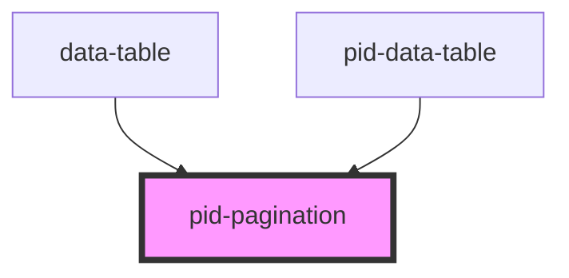

# pid-pagination

<!-- Auto Generated Below -->

## Properties

| Property       | Attribute        | Description                  | Type     | Default |
|----------------|------------------|------------------------------|----------|---------|
| `currentPage`  | `current-page`   | Current page (0-based index) | `number` | `0`     |
| `itemsPerPage` | `items-per-page` | Number of items per page     | `number` | `10`    |
| `totalItems`   | `total-items`    | Total number of items        | `number` | `0`     |

## Events

| Event        | Description                     | Type                  |
|--------------|---------------------------------|-----------------------|
| `pageChange` | Event emitted when page changes | `CustomEvent<number>` |

## Dependencies

### Used by

- [data-table](../data-table)
- [pid-data-table](../data-table)

### Graph

----------------------------------------------

*Built with [StencilJS](https://stenciljs.com/)*
