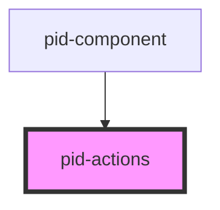

# pid-actions

<!-- Auto Generated Below -->

## Properties

| Property  | Attribute | Description                 | Type               | Default |
| --------- | --------- | --------------------------- | ------------------ | ------- |
| `actions` | `actions` | Array of actions to display | `FoldableAction[]` | `[]`    |

## Dependencies

### Used by

 - [pid-component](../pid-component)

### Graph

----------------------------------------------

*Built with [StencilJS](https://stenciljs.com/)*
