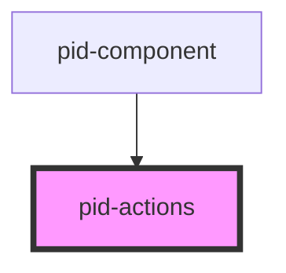

# pid-actions

<!-- Auto Generated Below -->

## Properties

| Property    | Attribute    | Description                                                                                  | Type                            | Default     |
|-------------|--------------|----------------------------------------------------------------------------------------------|---------------------------------|-------------|
| `actions`   | --           | Array of actions to display                                                                  | `FoldableAction[]`              | `[]`        |
| `actionsId` | `actions-id` | Optional ID for the actions container for ARIA references                                    | `string`                        | `undefined` |
| `darkMode`  | `dark-mode`  | The dark mode setting for the component Options: "light", "dark", "system" Default: "system" | `"dark" \| "light" \| "system"` | `'system'`  |

## Dependencies

### Used by

 - [pid-component](../pid-component)

### Graph

----------------------------------------------

*Built with [StencilJS](https://stenciljs.com/)*
