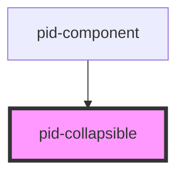

# pid-collapsible

# pid-collapsible

A collapsible component that can be toggled between expanded and collapsed states.

## Features

- Toggle between expanded and collapsed states
- Resizable when expanded
- Cross-browser compatibility (including Safari)
- Custom styling options
- Slots for summary content and actions

## Usage

```html
<pid-collapsible open="false" emphasize="true">
  <span slot="summary">Collapsible Title</span>
  <button slot="summary-actions" class="bg-blue-500 text-white px-2 py-1 rounded">Action</button>
  <div>
    <p>This is the content of the collapsible component.</p>
    <p>It can contain any HTML content.</p>
  </div>
</pid-collapsible>
```

## Properties

| Property        | Attribute       | Description                                 | Type      | Default |
|-----------------|-----------------|---------------------------------------------|-----------|---------|
| `open`          | `open`          | Whether the collapsible is open by default  | `boolean` | `false` |
| `emphasize`     | `emphasize`     | Whether to emphasize with border and shadow | `boolean` | `false` |
| `expanded`      | `expanded`      | Whether component is in expanded mode       | `boolean` | `false` |
| `initialWidth`  | `initialWidth`  | Initial width when expanded                 | `string`  | `500px` |
| `initialHeight` | `initialHeight` | Initial height when expanded                | `string`  | `300px` |
| `lineHeight`    | `lineHeight`    | Line height for collapsed state             | `number`  | `24`    |

## Events

| Event               | Description                         | Type                   |
|---------------------|-------------------------------------|------------------------|
| `collapsibleToggle` | Emitted when collapsible is toggled | `CustomEvent<boolean>` |

## Slots

| Name              | Description                        |
|-------------------|------------------------------------|
| `summary`         | Content for the collapsible header |
| `summary-actions` | Actions displayed in the header    |
| `(default)`       | Main content of the collapsible    |
<!-- Auto Generated Below -->


## Overview

Component for creating collapsible/expandable content sections
with resize capability and cross-browser compatibility

## Properties

| Property        | Attribute        | Description                                                                                  | Type                            | Default     |
| --------------- | ---------------- | -------------------------------------------------------------------------------------------- | ------------------------------- | ----------- |
| `darkMode`      | `dark-mode`      | The dark mode setting for the component Options: "light", "dark", "system" Default: "system" | `"dark" \| "light" \| "system"` | `'system'`  |
| `emphasize`     | `emphasize`      | Whether to emphasize the component with border and shadow                                    | `boolean`                       | `false`     |
| `expanded`      | `expanded`       | Whether the component is in expanded mode (full size)                                        | `boolean`                       | `false`     |
| `initialHeight` | `initial-height` | Initial height when expanded                                                                 | `string`                        | `undefined` |
| `initialWidth`  | `initial-width`  | Initial width when expanded                                                                  | `string`                        | `undefined` |
| `lineHeight`    | `line-height`    | Line height for collapsed state                                                              | `number`                        | `24`        |
| `open`          | `open`           | Whether the collapsible is open by default                                                   | `boolean`                       | `false`     |
| `showFooter`    | `show-footer`    | Whether to show the footer section                                                           | `boolean`                       | `false`     |


## Events

| Event                 | Description                                                                                                 | Type                                  |
| --------------------- | ----------------------------------------------------------------------------------------------------------- | ------------------------------------- |
| `collapsibleToggle`   | Event emitted when the collapsible is toggled                                                               | `CustomEvent<boolean>`                |
| `contentHeightChange` | Event emitted when content dimensions need to be recalculated Useful for pagination to ensure proper height | `CustomEvent<{ maxHeight: number; }>` |


## Methods

### `recalculateContentDimensions() => Promise<any>`

Public method to recalculate content dimensions
Can be called externally, for example when pagination changes
Optimized for better performance

#### Returns

Type: `Promise<any>`


## Dependencies

### Used by

 - [pid-component](../pid-component)

### Graph


----------------------------------------------

*Built with [StencilJS](https://stenciljs.com/)*
