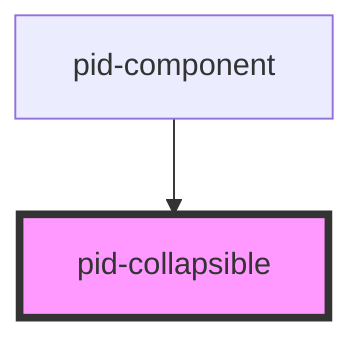

# pid-collapsible

<!-- Auto Generated Below -->

## Properties

| Property        | Attribute        | Description                                               | Type      | Default     |
|-----------------|------------------|-----------------------------------------------------------|-----------|-------------|
| `emphasize`     | `emphasize`      | Whether to emphasize the component with border and shadow | `boolean` | `false`     |
| `expanded`      | `expanded`       | Whether the component is in expanded mode (full size)     | `boolean` | `false`     |
| `initialHeight` | `initial-height` | Initial height when expanded                              | `string`  | `undefined` |
| `initialWidth`  | `initial-width`  | Initial width when expanded                               | `string`  | `undefined` |
| `lineHeight`    | `line-height`    | Line height for collapsed state                           | `number`  | `24`        |
| `open`          | `open`           | Whether the collapsible is open by default                | `boolean` | `false`     |

## Events

| Event               | Description                                   | Type                   |
|---------------------|-----------------------------------------------|------------------------|
| `collapsibleToggle` | Event emitted when the collapsible is toggled | `CustomEvent<boolean>` |

## Dependencies

### Used by

- [pid-component](../pid-component)

### Graph

----------------------------------------------

*Built with [StencilJS](https://stenciljs.com/)*
