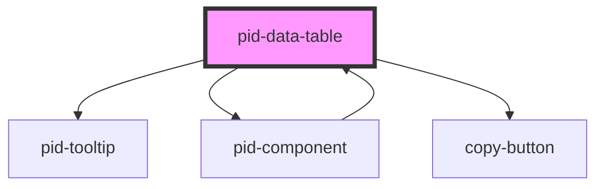

# pid-data-table

<!-- Auto Generated Below -->

## Properties

| Property                      | Attribute                        | Description                                                                                  | Type                            | Default                |
|-------------------------------|----------------------------------|----------------------------------------------------------------------------------------------|---------------------------------|------------------------|
| `currentLevelOfSubcomponents` | `current-level-of-subcomponents` | Current level of subcomponents                                                               | `number`                        | `0`                    |
| `currentPage`                 | `current-page`                   | Current page (0-based index)                                                                 | `number`                        | `0`                    |
| `darkMode`                    | `dark-mode`                      | The dark mode setting for the component Options: "light", "dark", "system" Default: "system" | `"dark" \| "light" \| "system"` | `'system'`             |
| `hideSubcomponents`           | `hide-subcomponents`             | Whether to hide subcomponents                                                                | `boolean`                       | `false`                |
| `items`                       | `items`                          | Array of items to display in the table                                                       | `FoldableItem[]`                | `[]`                   |
| `itemsPerPage`                | `items-per-page`                 | Number of items to show per page                                                             | `number`                        | `10`                   |
| `levelOfSubcomponents`        | `level-of-subcomponents`         | Total level of subcomponents                                                                 | `number`                        | `1`                    |
| `loadSubcomponents`           | `load-subcomponents`             | Whether to load subcomponents                                                                | `boolean`                       | `false`                |
| `pageSizes`                   | `page-sizes`                     | Available page sizes                                                                         | `number[]`                      | `[5, 10, 25, 50, 100]` |
| `settings`                    | `settings`                       | Settings to pass to subcomponents                                                            | `string`                        | `'[]'`                 |

## Events

| Event                | Description                               | Type                  |
| -------------------- | ----------------------------------------- | --------------------- |
| `itemsPerPageChange` | Event emitted when items per page changes | `CustomEvent<number>` |
| `pageChange`         | Event emitted when page changes           | `CustomEvent<number>` |

## Dependencies

### Used by

 - [pid-component](../pid-component)

### Depends on

- [pid-tooltip](../pid-tooltip)
- [pid-component](../pid-component)
- [copy-button](../copy-button)

### Graph

----------------------------------------------

*Built with [StencilJS](https://stenciljs.com/)*
