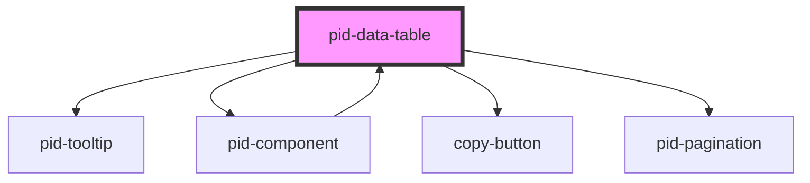

# pid-data-table

<!-- Auto Generated Below -->

## Properties

| Property                      | Attribute                        | Description                            | Type             | Default |
|-------------------------------|----------------------------------|----------------------------------------|------------------|---------|
| `currentLevelOfSubcomponents` | `current-level-of-subcomponents` | Current level of subcomponents         | `number`         | `0`     |
| `currentPage`                 | `current-page`                   | Current page (0-based index)           | `number`         | `0`     |
| `hideSubcomponents`           | `hide-subcomponents`             | Whether to hide subcomponents          | `boolean`        | `false` |
| `items`                       | `items`                          | Array of items to display in the table | `FoldableItem[]` | `[]`    |
| `itemsPerPage`                | `items-per-page`                 | Number of items to show per page       | `number`         | `10`    |
| `levelOfSubcomponents`        | `level-of-subcomponents`         | Total level of subcomponents           | `number`         | `1`     |
| `loadSubcomponents`           | `load-subcomponents`             | Whether to load subcomponents          | `boolean`        | `false` |
| `settings`                    | `settings`                       | Settings to pass to subcomponents      | `string`         | `'[]'`  |

## Events

| Event        | Description                     | Type                  |
|--------------|---------------------------------|-----------------------|
| `pageChange` | Event emitted when page changes | `CustomEvent<number>` |

## Dependencies

### Used by

- [pid-component](../pid-component)

### Depends on

- [pid-tooltip](../pid-tooltip)
- [pid-component](../pid-component)
- [copy-button](../copy-button)
- [pid-pagination](../pid-pagination)

### Graph

----------------------------------------------

*Built with [StencilJS](https://stenciljs.com/)*
