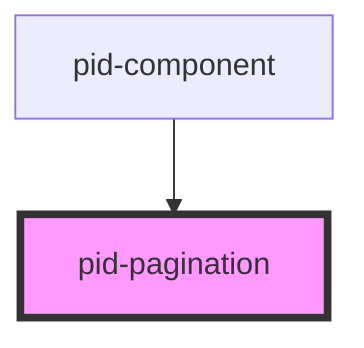

# pid-pagination

<!-- Auto Generated Below -->

## Properties

| Property                  | Attribute                     | Description                                                                                  | Type                            | Default                |
| ------------------------- | ----------------------------- | -------------------------------------------------------------------------------------------- | ------------------------------- | ---------------------- |
| `currentPage`             | `current-page`                | Current page (0-based index)                                                                 | `number`                        | `0`                    |
| `darkMode`                | `dark-mode`                   | The dark mode setting for the component Options: "light", "dark", "system" Default: "system" | `"dark" \| "light" \| "system"` | `'system'`             |
| `itemsPerPage`            | `items-per-page`              | Number of items per page                                                                     | `number`                        | `10`                   |
| `pageSizes`               | --                            | Available page sizes                                                                         | `number[]`                      | `[5, 10, 25, 50, 100]` |
| `showItemsPerPageControl` | `show-items-per-page-control` | Whether to show the items per page control                                                   | `boolean`                       | `true`                 |
| `totalItems`              | `total-items`                 | Total number of items                                                                        | `number`                        | `0`                    |

## Events

| Event                | Description                               | Type                  |
| -------------------- | ----------------------------------------- | --------------------- |
| `itemsPerPageChange` | Event emitted when items per page changes | `CustomEvent<number>` |
| `pageChange`         | Event emitted when page changes           | `CustomEvent<number>` |

## Dependencies

### Used by

 - [pid-component](../pid-component)

### Graph

----------------------------------------------

*Built with [StencilJS](https://stenciljs.com/)*
