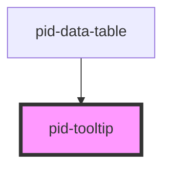

# pid-tooltip

<!-- Auto Generated Below -->

## Properties

| Property            | Attribute     | Description                                               | Type                | Default     |
|---------------------|---------------|-----------------------------------------------------------|---------------------|-------------|
| `fitContent`        | `fit-content` | Whether the tooltip should fit its content height exactly | `boolean`           | `true`      |
| `maxHeight`         | `max-height`  | The maximum height of the tooltip                         | `string`            | `'150px'`   |
| `maxWidth`          | `max-width`   | The maximum width of the tooltip                          | `string`            | `'250px'`   |
| `position`          | `position`    | The preferred position of the tooltip (top or bottom)     | `"bottom" \| "top"` | `'top'`     |
| `text` _(required)_ | `text`        | The text to display in the tooltip                        | `string`            | `undefined` |

## Events

| Event                    | Description                                       | Type                                                        |
|--------------------------|---------------------------------------------------|-------------------------------------------------------------|
| `tooltipExpansionChange` | Event emitted when tooltip requires row expansion | `CustomEvent<{ expand: boolean; requiredHeight: number; }>` |

## Dependencies

### Used by

 - [pid-data-table](../pid-data-table)

### Graph

----------------------------------------------

*Built with [StencilJS](https://stenciljs.com/)*
