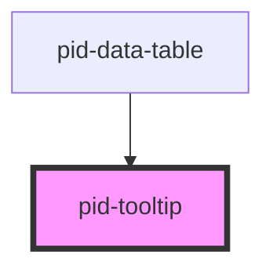

# pid-tooltip

<!-- Auto Generated Below -->

## Properties

| Property            | Attribute     | Description                                                                                                 | Type                            | Default     |
| ------------------- | ------------- | ----------------------------------------------------------------------------------------------------------- | ------------------------------- | ----------- |
| `darkMode`          | `dark-mode`   | Dark mode setting for the tooltip. When provided, this takes precedence over DOM-based dark mode detection. | `"dark" \| "light" \| "system"` | `'light'`   |
| `fitContent`        | `fit-content` | Whether the tooltip should fit its content height exactly                                                   | `boolean`                       | `true`      |
| `maxHeight`         | `max-height`  | The maximum height of the tooltip                                                                           | `string`                        | `'150px'`   |
| `maxWidth`          | `max-width`   | The maximum width of the tooltip                                                                            | `string`                        | `'250px'`   |
| `position`          | `position`    | The preferred position of the tooltip (top or bottom)                                                       | `"bottom" \| "top"`             | `'top'`     |
| `text` _(required)_ | `text`        | The text to display in the tooltip                                                                          | `string`                        | `undefined` |

## Events

| Event                    | Description                                       | Type                                                        |
| ------------------------ | ------------------------------------------------- | ----------------------------------------------------------- |
| `tooltipExpansionChange` | Event emitted when tooltip requires row expansion | `CustomEvent<{ expand: boolean; requiredHeight: number; }>` |

## Slots

| Slot        | Description |
|-------------|-------------|
| `"trigger"` |             |

## Dependencies

### Used by

 - [pid-data-table](../pid-data-table)

### Graph

```mermaid
graph TD;
  pid-data-table --> pid-tooltip
  style pid-tooltip fill:#f9f,stroke:#333,stroke-width:4px
```

----------------------------------------------

*Built with [StencilJS](https://stenciljs.com/)*
