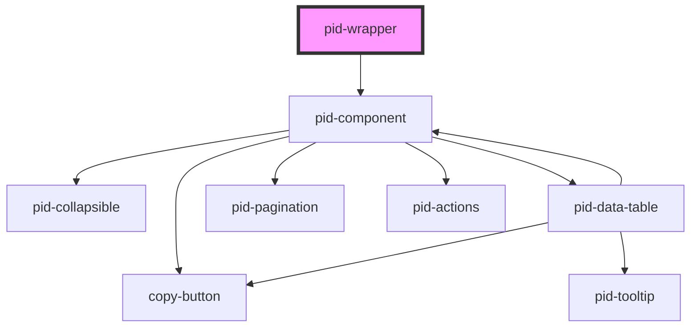

# pid-wrapper

<!-- Auto Generated Below -->

## Properties

| Property               | Attribute                | Description                                                                                            | Type                            | Default               |
| ---------------------- | ------------------------ | ------------------------------------------------------------------------------------------------------ | ------------------------------- | --------------------- |
| `amountOfItems`        | `amount-of-items`        | Number of table rows per page in each detected pid-component.                                          | `number`                        | `10`                  |
| `darkMode`             | `dark-mode`              | Dark-mode setting forwarded to every detected pid-component.                                           | `"dark" \| "light" \| "system"` | `'light'`             |
| `defaultTTL`           | `default-t-t-l`          | Default time-to-live (ms) for IndexedDB cache entries.                                                 | `number`                        | `24 * 60 * 60 * 1000` |
| `emphasizeComponent`   | `emphasize-component`    | Whether detected pid-components show a border/shadow emphasis.                                         | `boolean`                       | `true`                |
| `height`               | `height`                 | Initial height applied to each detected pid-component (e.g. '300px').                                  | `string`                        | `undefined`           |
| `hideSubcomponents`    | `hide-subcomponents`     | When true, sub-components are never shown.                                                             | `boolean`                       | `false`               |
| `levelOfSubcomponents` | `level-of-subcomponents` | Maximum depth of nested sub-components to render.                                                      | `number`                        | `1`                   |
| `openByDefault`        | `open-by-default`        | Whether detected pid-components should be open by default.                                             | `boolean`                       | `false`               |
| `settings`             | `settings`               | Stringified JSON settings passed to each detected pid-component.                                       | `string`                        | `'[]'`                |
| `showTopLevelCopy`     | `show-top-level-copy`    | Whether the copy button is shown at the top level of detected pid-components.                          | `boolean`                       | `true`                |
| `targetSelector`       | `target-selector`        | CSS selector for the area in which identifiers should be detected. Defaults to the full document body. | `string`                        | `'body'`              |
| `width`                | `width`                  | Initial width applied to each detected pid-component (e.g. '500px').                                   | `string`                        | `undefined`           |

## Dependencies

### Depends on

- [pid-component](../pid-component)

### Graph

----------------------------------------------

*Built with [StencilJS](https://stenciljs.com/)*
