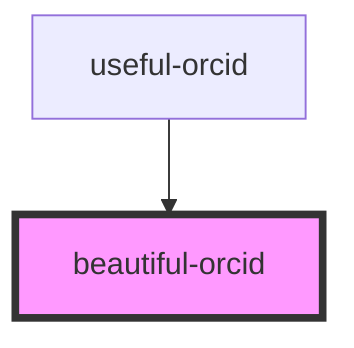

# beautiful-orcid

<!-- Auto Generated Below -->

## Properties

| Property             | Attribute          | Description                                                                                                                                                            | Type      | Default                |
| -------------------- | ------------------ | ---------------------------------------------------------------------------------------------------------------------------------------------------------------------- | --------- | ---------------------- |
| `affiliationAt`      | --                 | The date of the affiliation to display. (optional) Defaults to the current date.                                                                                       | `Date`    | `new Date(Date.now())` |
| `orcid` _(required)_ | `orcid`            | The ORCiD to display, evaluate and link in this component. (required)                                                                                                  | `string`  | `undefined`            |
| `showAffiliation`    | `show-affiliation` | Whether to show the affiliation or not. (optional) Defaults to true.                                                                                                   | `boolean` | `true`                 |
| `showDepartment`     | `show-department`  | Whether to show the department of the affiliation or not. Depends internally on availability of the department in the ORCiD information. (optional) Defaults to false. | `boolean` | `false`                |
| `showOrcid`          | `show-orcid`       | Whether to show the ORCiD inline or not. (optional) Defaults to false.                                                                                                 | `boolean` | `false`                |

## Dependencies

### Used by

 - [useful-orcid](../useful-orcid)

### Graph

----------------------------------------------

*Built with [StencilJS](https://stenciljs.com/)*
