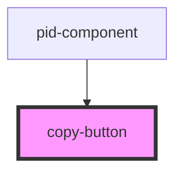

# copy-button

<!-- Auto Generated Below -->

## Properties

| Property             | Attribute | Description                         | Type     | Default     |
| -------------------- | --------- | ----------------------------------- | -------- | ----------- |
| `value` _(required)_ | `value`   | The value to copy to the clipboard. | `string` | `undefined` |

## Dependencies

### Used by

 - [pid-component](../pid-component)

### Graph

----------------------------------------------

*Built with [StencilJS](https://stenciljs.com/)*
