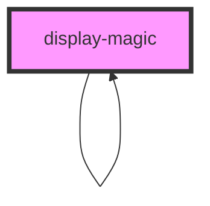

# display-magic


<!-- Auto Generated Below -->


## Properties

| Property                      | Attribute                        | Description                                                                                                                                                                                                                                                                                                                                            | Type      | Default     |
| ----------------------------- | -------------------------------- | ------------------------------------------------------------------------------------------------------------------------------------------------------------------------------------------------------------------------------------------------------------------------------------------------------------------------------------------------------ | --------- | ----------- |
| `amountOfItems`               | `amount-of-items`                | The number of items to show in the table per page. Defaults to 10. (optional)                                                                                                                                                                                                                                                                          | `number`  | `10`        |
| `currentLevelOfSubcomponents` | `current-level-of-subcomponents` | The current level of subcomponents. Defaults to 0. (optional)                                                                                                                                                                                                                                                                                          | `number`  | `0`         |
| `doNOTShowSubcomponents`      | `do-n-o-t-show-subcomponents`    | Determines whether subcomponents should generally be shown or not. If set to true, the component won't show any subcomponents. If not set, the component will show subcomponents, if the current level of subcomponents is not the total level of subcomponents or greater. (optional)                                                                 | `boolean` | `undefined` |
| `levelOfSubcomponents`        | `level-of-subcomponents`         | The total number of levels of subcomponents to show. Defaults to 1. (optional)                                                                                                                                                                                                                                                                         | `number`  | `1`         |
| `openByDefault`               | `open-by-default`                | Determines whether the component is open or not by default. (optional)                                                                                                                                                                                                                                                                                 | `boolean` | `undefined` |
| `settings`                    | `settings`                       | A stringified JSON object containing settings for this component. The resulting object is passed to every subcomponent, so that every component has the same settings. Values and the according type are defined by the components themselves. (optional)  Schema: ```typescript {  type: string,  values: {   name: string,   value: any  }[] }[] ``` | `string`  | `undefined` |
| `value`                       | `value`                          | The value to parse, evaluate and render.                                                                                                                                                                                                                                                                                                               | `string`  | `undefined` |


## Dependencies

### Used by

 - [display-magic](.)

### Depends on

- [display-magic](.)

### Graph


----------------------------------------------

*Built with [StencilJS](https://stenciljs.com/)*
