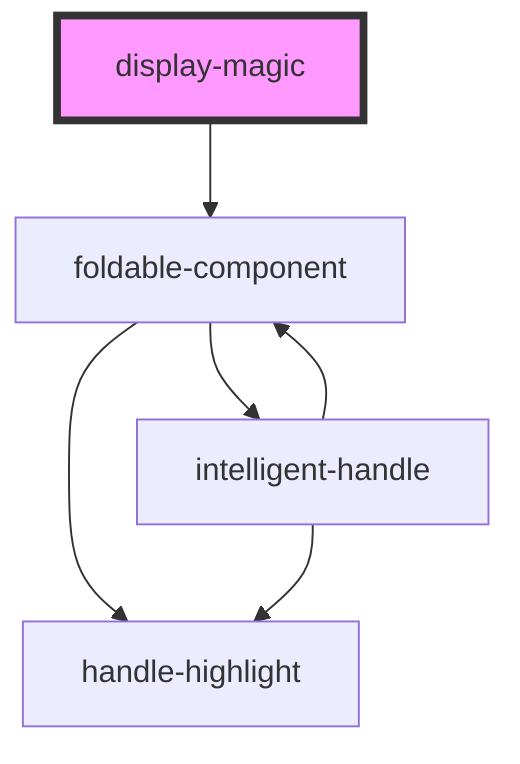

# display-magic

<!-- Auto Generated Below -->

## Properties

| Property                      | Attribute                        | Description | Type                                                           | Default     |
| ----------------------------- | -------------------------------- | ----------- | -------------------------------------------------------------- | ----------- |
| `changingColors`              | `changing-colors`                |             | `boolean`                                                      | `true`      |
| `currentLevelOfSubcomponents` | `current-level-of-subcomponents` |             | `number`                                                       | `0`         |
| `levelOfSubcomponents`        | `level-of-subcomponents`         |             | `number`                                                       | `1`         |
| `openStatus`                  | `open-status`                    |             | `boolean`                                                      | `false`     |
| `settings`                    | --                               |             | `{ type: string; values: { name: string; value: any; }[]; }[]` | `undefined` |
| `value`                       | `value`                          |             | `string`                                                       | `undefined` |

## Dependencies

### Depends on

- [foldable-component](../foldable-component)

### Graph

----------------------------------------------

*Built with [StencilJS](https://stenciljs.com/)*
