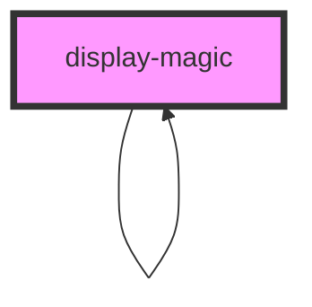

# display-magic


<!-- Auto Generated Below -->


## Properties

| Property                      | Attribute                        | Description                                                                                                                                                                                                                                                                                                                                            | Type      | Default     |
| ----------------------------- | -------------------------------- | ------------------------------------------------------------------------------------------------------------------------------------------------------------------------------------------------------------------------------------------------------------------------------------------------------------------------------------------------------ | --------- | ----------- |
| `amountOfItems`               | `amount-of-items`                | The amount of items to show in the table per page. Defaults to 10. (optional)                                                                                                                                                                                                                                                                          | `number`  | `10`        |
| `changingColors`              | `changing-colors`                | Determines whether the colors of the table inside the component should change or not. Defaults to true. (optional)                                                                                                                                                                                                                                     | `boolean` | `true`      |
| `currentLevelOfSubcomponents` | `current-level-of-subcomponents` | The current level of subcomponents. Defaults to 0. (optional)                                                                                                                                                                                                                                                                                          | `number`  | `0`         |
| `levelOfSubcomponents`        | `level-of-subcomponents`         | The total amount of levels of subcomponents to show. Defaults to 1. (optional)                                                                                                                                                                                                                                                                         | `number`  | `1`         |
| `openStatus`                  | `open-status`                    | Determines whether the component is open or not by default. Defaults to false. (optional)                                                                                                                                                                                                                                                              | `boolean` | `false`     |
| `settings`                    | `settings`                       | A stringified JSON object containing settings for this component. The resulting object is passed to every subcomponent, so that every component has the same settings. Values and the according type are defined by the components themselves. (optional)  Schema: ```typescript {  type: string,  values: {   name: string,   value: any  }[] }[] ``` | `string`  | `undefined` |
| `showSubcomponents`           | `show-subcomponents`             | Determines whether subcomponents should generally be shown or not. If set to true but the total level of subcomponents is reached, subcomponents will not be shown. Defaults to true. (optional)                                                                                                                                                       | `boolean` | `true`      |
| `value`                       | `value`                          | The value to parse, evaluate and render.                                                                                                                                                                                                                                                                                                               | `string`  | `undefined` |


## Dependencies

### Used by

 - [display-magic](.)

### Depends on

- [display-magic](.)

### Graph


----------------------------------------------

*Built with [StencilJS](https://stenciljs.com/)*
