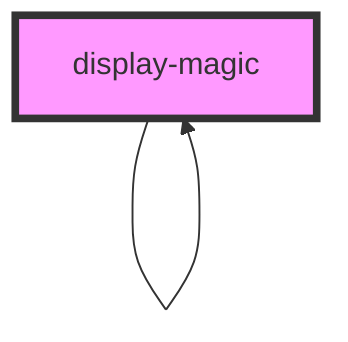

# display-magic

<!-- Auto Generated Below -->

## Properties

| Property                      | Attribute                        | Description | Type      | Default     |
| ----------------------------- | -------------------------------- | ----------- | --------- | ----------- |
| `amountOfItems`               | `amount-of-items`                |             | `number`  | `10`        |
| `changingColors`              | `changing-colors`                |             | `boolean` | `true`      |
| `currentLevelOfSubcomponents` | `current-level-of-subcomponents` |             | `number`  | `0`         |
| `levelOfSubcomponents`        | `level-of-subcomponents`         |             | `number`  | `1`         |
| `openStatus`                  | `open-status`                    |             | `boolean` | `false`     |
| `settings`                    | `settings`                       |             | `string`  | `undefined` |
| `showSubcomponents`           | `show-subcomponents`             |             | `boolean` | `true`      |
| `value`                       | `value`                          |             | `string`  | `undefined` |

## Dependencies

### Used by

 - [display-magic](.)

### Depends on

- [display-magic](.)

### Graph

----------------------------------------------

*Built with [StencilJS](https://stenciljs.com/)*
