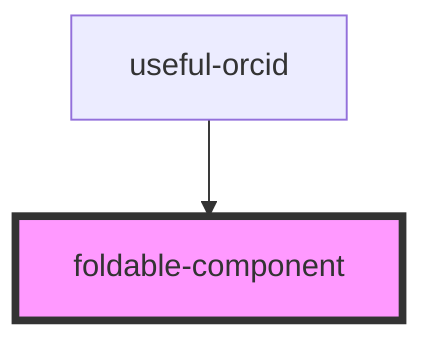

# foldable-component

<!-- Auto Generated Below -->

## Properties

| Property                      | Attribute                        | Description                                                                                                                                                             | Type               | Default                                                                                                                                                                                                                                                                                                                                                                                                                                                                                                                                                                                                                                                                                                                                                                                                                                                                                                                                                                                                                                                                                                                                                                                                                                                                                                                                                                                                                                                                                                                                                                                                                                                                                                                                                                                                                                                                                                                                                                                                                                                                                                                                                                                                                                                                                                                                                                                                                                                                                                                 |
| ----------------------------- | -------------------------------- | ----------------------------------------------------------------------------------------------------------------------------------------------------------------------- | ------------------ | ----------------------------------------------------------------------------------------------------------------------------------------------------------------------------------------------------------------------------------------------------------------------------------------------------------------------------------------------------------------------------------------------------------------------------------------------------------------------------------------------------------------------------------------------------------------------------------------------------------------------------------------------------------------------------------------------------------------------------------------------------------------------------------------------------------------------------------------------------------------------------------------------------------------------------------------------------------------------------------------------------------------------------------------------------------------------------------------------------------------------------------------------------------------------------------------------------------------------------------------------------------------------------------------------------------------------------------------------------------------------------------------------------------------------------------------------------------------------------------------------------------------------------------------------------------------------------------------------------------------------------------------------------------------------------------------------------------------------------------------------------------------------------------------------------------------------------------------------------------------------------------------------------------------------------------------------------------------------------------------------------------------------------------------------------------------------------------------------------------------------------------------------------------------------------------------------------------------------------------------------------------------------------------------------------------------------------------------------------------------------------------------------------------------------------------------------------------------------------------------------------------------------- |
| `actions`                     | --                               |                                                                                                                                                                         | `FoldableAction[]` | `[     // {     //   title: "View on FAIR Data Point",     //   link: "https://kit-fairdatapoint.esc.rzg.mpg.de/fdp/dataset/kitdm/",     //   style: "primary"     // },     // {     //   title: "View on FAIR Data Point",     //   link: "https://kit-fairdatapoint.esc.rzg.mpg.de/fdp/dataset/kitdm/",     //   style: "secondary"     // },     // {     //   title: "View on FAIR Data Point",     //   link: "https://kit-fairdatapoint.esc.rzg.mpg.de/fdp/dataset/kitdm/",     //   style: "danger"     // }   ]`                                                                                                                                                                                                                                                                                                                                                                                                                                                                                                                                                                                                                                                                                                                                                                                                                                                                                                                                                                                                                                                                                                                                                                                                                                                                                                                                                                                                                                                                                                                                                                                                                                                                                                                                                                                                                                                                                                                                                                                               |
| `changingColors`              | `changing-colors`                | Should the table inside the component change colors every other line?                                                                                                   | `boolean`          | `true`                                                                                                                                                                                                                                                                                                                                                                                                                                                                                                                                                                                                                                                                                                                                                                                                                                                                                                                                                                                                                                                                                                                                                                                                                                                                                                                                                                                                                                                                                                                                                                                                                                                                                                                                                                                                                                                                                                                                                                                                                                                                                                                                                                                                                                                                                                                                                                                                                                                                                                                  |
| `currentLevelOfSubcomponents` | `current-level-of-subcomponents` | The current elevation level of the subcomponents. If the difference between the current level and the level of the subcomponents is 0, the subcomponents are not shown. | `number`           | `0`                                                                                                                                                                                                                                                                                                                                                                                                                                                                                                                                                                                                                                                                                                                                                                                                                                                                                                                                                                                                                                                                                                                                                                                                                                                                                                                                                                                                                                                                                                                                                                                                                                                                                                                                                                                                                                                                                                                                                                                                                                                                                                                                                                                                                                                                                                                                                                                                                                                                                                                     |
| `items`                       | --                               |                                                                                                                                                                         | `FoldableItem[]`   | `[     // {     //   keyTitle: "Title",     //   keyTooltip: "The title of the dataset.",     //   keyLink: "https://schema.org/name",     //   value: "KIT Data Manager",     //   valueRegex: /KIT Data Manager/     // },     // {     //   keyTitle: "Description",     //   keyTooltip: "The description of the dataset.",     //   keyLink: "https://schema.org/description",     //   value: "The KIT Data Manager is a software for managing research data.",     //   valueRegex: /The KIT Data Manager is a software for managing research data./     // },     // {     //   keyTitle: "Identifier",     //   keyTooltip: "The identifier of the dataset.",     //   keyLink: "https://schema.org/identifier",     //   value: "https://doi.org/10.5445/IR/1000123456",     //   valueRegex: /https:\/\/doi.org\/10.5445\/IR\/1000123456/     // },     // {     //   keyTitle: "Publisher",     //   keyTooltip: "The publisher of the dataset.",     //   keyLink: "https://schema.org/publisher",     //   value: "Karlsruhe Institute of Technology (KIT)",     //   valueRegex: /Karlsruhe Institute of Technology \(KIT\)/     // },     // {     //   keyTitle: "Creator",     //   keyTooltip: "The creator of the dataset.",     //   keyLink: "https://schema.org/creator",     //   value: "Karlsruhe Institute of Technology (KIT)",     //   valueRegex: /Karlsruhe Institute of Technology \(KIT\)/     // },     // {     //   keyTitle: "Contributor",     //   keyTooltip: "The contributor of the dataset.",     //   keyLink: "https://schema.org/contributor",     //   value: "Karlsruhe Institute of Technology (KIT)",     //   valueRegex: /Karlsruhe Institute of Technology \(KIT\)/     // },     // {     //   keyTitle: "Date Published",     //   keyTooltip: "The date the dataset was published.",     //   keyLink: "https://schema.org/datePublished",     //   value: "2021-01-01",     //   valueRegex: /2021-01-01/     // },     // {     //   keyTitle: "Date Modified",     //   keyTooltip: "The date the dataset was modified.",     //   keyLink: "https://schema.org/dateModified",     //   value: "2021-01-01",     //   valueRegex: /2021-01-01/     // },     // {     //   keyTitle: "License",     //   keyTooltip: "The license of the dataset.",     //   keyLink: "https://schema.org/license",     //   value: "https://creativecommons.org/licenses/by/4.0/",     //   valueRegex: /https:\/\/creativecommons.org\/licenses\/by\/4.0\//     // }   ]` |
| `levelOfSubcomponents`        | `level-of-subcomponents`         | The maximum level of subcomponents to show.                                                                                                                             | `number`           | `1`                                                                                                                                                                                                                                                                                                                                                                                                                                                                                                                                                                                                                                                                                                                                                                                                                                                                                                                                                                                                                                                                                                                                                                                                                                                                                                                                                                                                                                                                                                                                                                                                                                                                                                                                                                                                                                                                                                                                                                                                                                                                                                                                                                                                                                                                                                                                                                                                                                                                                                                     |
| `openStatus`                  | `open-status`                    | Should the details element be open by default?                                                                                                                          | `boolean`          | `false`                                                                                                                                                                                                                                                                                                                                                                                                                                                                                                                                                                                                                                                                                                                                                                                                                                                                                                                                                                                                                                                                                                                                                                                                                                                                                                                                                                                                                                                                                                                                                                                                                                                                                                                                                                                                                                                                                                                                                                                                                                                                                                                                                                                                                                                                                                                                                                                                                                                                                                                 |
| `showSubcomponents`           | `show-subcomponents`             | Should the subcomponents be shown?                                                                                                                                      | `boolean`          | `true`                                                                                                                                                                                                                                                                                                                                                                                                                                                                                                                                                                                                                                                                                                                                                                                                                                                                                                                                                                                                                                                                                                                                                                                                                                                                                                                                                                                                                                                                                                                                                                                                                                                                                                                                                                                                                                                                                                                                                                                                                                                                                                                                                                                                                                                                                                                                                                                                                                                                                                                  |

## Dependencies

### Used by

 - [useful-orcid](../useful-orcid)

### Graph

----------------------------------------------

*Built with [StencilJS](https://stenciljs.com/)*
