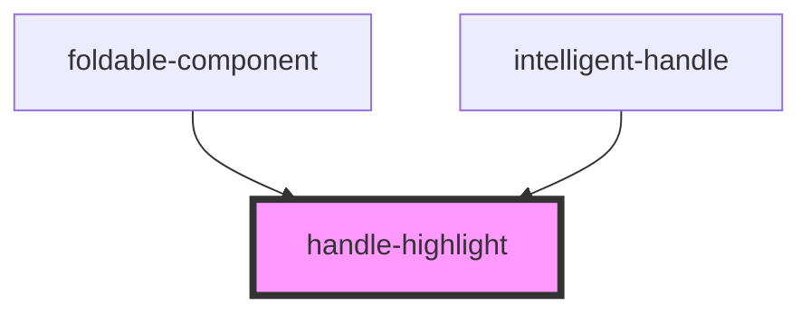

# handle-highlight

<!-- Auto Generated Below -->

## Overview

This component highlights a handle and links to the FAIR DO Scope.
It automatically generates colors for the parts of the handle (prefix and suffix) to make them easily distinguishable.

## Properties

| Property              | Attribute | Description                                                                                 | Type                                         | Default         |
| --------------------- | --------- | ------------------------------------------------------------------------------------------- | -------------------------------------------- | --------------- |
| `filled`              | `filled`  | Whether the component should use the filled or the outlined design.                         | `boolean`                                    | `false`         |
| `handle` _(required)_ | `handle`  | The Handle to highlight and link in this component.                                         | `string`                                     | `undefined`     |
| `linkTo`              | `link-to` | An optional custom link to use instead of the default one which links to the FAIR DO Scope. | `"disable" \| "fairdoscope" \| "resolveRef"` | `'fairdoscope'` |

## Dependencies

### Used by

 - [foldable-component](../foldable-component)
 - [intelligent-handle](../intelligent-handle)

### Graph

----------------------------------------------

*Built with [StencilJS](https://stenciljs.com/)*
