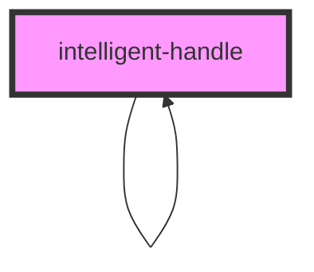

# intelligent-handle

<!-- Auto Generated Below -->

## Properties

| Property                      | Attribute                        | Description                                                                                                                                                             | Type      | Default     |
| ----------------------------- | -------------------------------- | ----------------------------------------------------------------------------------------------------------------------------------------------------------------------- | --------- | ----------- |
| `changingColors`              | `changing-colors`                | Should the table inside the component change colors every other line?                                                                                                   | `boolean` | `true`      |
| `currentLevelOfSubcomponents` | `current-level-of-subcomponents` | The current elevation level of the subcomponents. If the difference between the current level and the level of the subcomponents is 0, the subcomponents are not shown. | `number`  | `0`         |
| `handle` _(required)_         | `handle`                         | The Handle to highlight and link in this component.                                                                                                                     | `string`  | `undefined` |
| `levelOfSubcomponents`        | `level-of-subcomponents`         | The maximum level of subcomponents to show.                                                                                                                             | `number`  | `1`         |
| `openStatus`                  | `open-status`                    | Should the details element be open by default?                                                                                                                          | `boolean` | `false`     |
| `showSubcomponents`           | `show-subcomponents`             | Should the subcomponents be shown?                                                                                                                                      | `boolean` | `true`      |

## Dependencies

### Used by

 - [intelligent-handle](.)

### Depends on

- [intelligent-handle](.)
- [handle-highlight](../handle-highlight)

### Graph

----------------------------------------------

*Built with [StencilJS](https://stenciljs.com/)*
