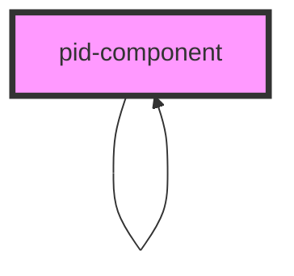

# display-magic

<!-- Auto Generated Below -->


## Properties

| Property                      | Attribute                           | Description                                                                                                                                                                                                                                                                                                                                            | Type      | Default               |
| ----------------------------- | ----------------------------------- | ------------------------------------------------------------------------------------------------------------------------------------------------------------------------------------------------------------------------------------------------------------------------------------------------------------------------------------------------------ | --------- | --------------------- |
| `amountOfItems`               | `amount-of-items`                   | The number of items to show in the table per page. Defaults to 10. (optional)                                                                                                                                                                                                                                                                          | `number`  | `10`                  |
| `currentLevelOfSubcomponents` | `current-level-of-subcomponents`    | The current level of subcomponents. Defaults to 0. (optional)                                                                                                                                                                                                                                                                                          | `number`  | `0`                   |
| `defaultTTL`                  | `default-t-t-l`                     | Determines the default time to live (TTL) for entries in the IndexedDB. Defaults to 24 hours. Units are in milliseconds. (optional)                                                                                                                                                                                                                    | `number`  | `24 * 60 * 60 * 1000` |
| `doNotCacheOrStoreInDatabase` | `do-not-cache-or-store-in-database` | If this flag is set to true, the component will reset the cache and database on every load and disconnect. Already existing data will be deleted.                                                                                                                                                                                                      | `boolean` | `false`               |
| `emphasizeComponent`          | `emphasize-component`               | Determines whether components should be emphasized towards their surrounding by border and shadow. If set to true, border and shadows will be shown around the component. It not set, the component won't be surrounded by border and shadow. (optional)                                                                                               | `boolean` | `true`                |
| `hideSubcomponents`           | `hide-subcomponents`                | Determines whether subcomponents should generally be shown or not. If set to true, the component won't show any subcomponents. If not set, the component will show subcomponents if the current level of subcomponents is not the total level of subcomponents or greater. (optional)                                                                  | `boolean` | `undefined`           |
| `levelOfSubcomponents`        | `level-of-subcomponents`            | The total number of levels of subcomponents to show. Defaults to 1. (optional)                                                                                                                                                                                                                                                                         | `number`  | `1`                   |
| `openByDefault`               | `open-by-default`                   | Determines whether the component is open or not by default. (optional)                                                                                                                                                                                                                                                                                 | `boolean` | `undefined`           |
| `settings`                    | `settings`                          | A stringified JSON object containing settings for this component. The resulting object is passed to every subcomponent, so that every component has the same settings. Values and the according type are defined by the components themselves. (optional)  Schema: ```typescript {  type: string,  values: {   name: string,   value: any  }[] }[] ``` | `string`  | `undefined`           |
| `showTopLevelCopy`            | `show-top-level-copy`               | Determines whether on the top level the copy button is shown. If set to true, the copy button is shown also on the top level. It not set, the copy button is only shown for sub-components. (optional)                                                                                                                                                 | `boolean` | `true`                |
| `value`                       | `value`                             | The value to parse, evaluate and render.                                                                                                                                                                                                                                                                                                               | `string`  | `undefined`           |


## Dependencies

### Used by

 - [pid-component](.)

### Depends on

- [copy-button](../copy-button)
- [pid-component](.)

### Graph


----------------------------------------------

*Built with [StencilJS](https://stenciljs.com/)*
